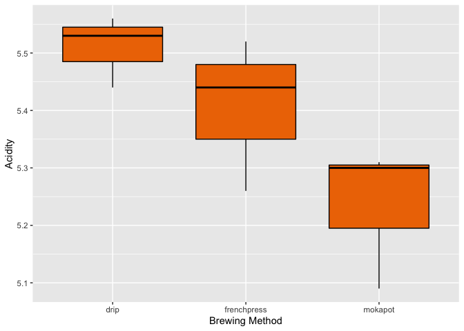
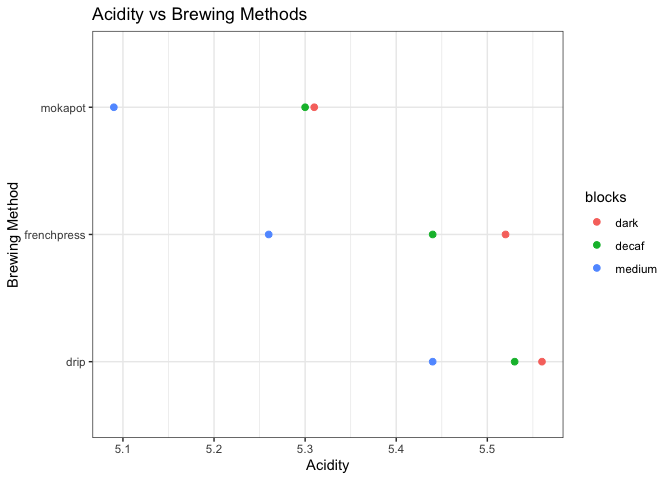
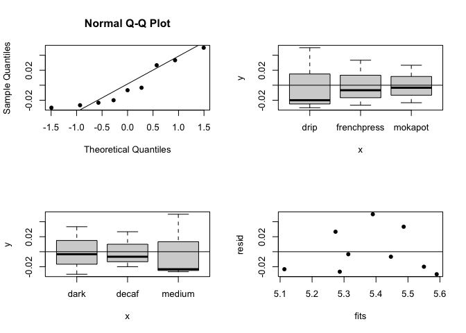

Analyzing coffee acidity for different brewing methods
================

# RCBD with roast as the block

This is an experiment to figure out if different brewing methods affect
the acidity of a cup of coffee. We compared a drip machine, French
press, and a Moka pot and used Dunkin brand medium, dark, and decaf
roasts. To get the acidity readings, a digital ph meter was used.

We determined the best approach to try and answer our research question
was a randomized complete block design. The treatments would be the
different brewing methods while our blocking variable would be the roast
of coffee. This design requires randomizing observations across each
block which we established with a random number generator to set the
measurement order of the brewing method for each roast.

## Measurement data

Constructing our dataframe with the blocks and treatments. On the PH
scale, lower values are more acidic.

``` r
library(tidyverse)
library(agricolae)
library(car)

frenchpress <- c(5.26, 5.52, 5.44)
mokapot <- c(5.09, 5.31, 5.30)
drip <- c(5.44, 5.56, 5.53)

y <- c(frenchpress, mokapot, drip)
blocks <- as.factor(rep(c("medium", "dark", "decaf"), times = 3))
treat <- as.factor(rep(c("frenchpress", "mokapot", "drip"), each = 3))
coffeedat <- data.frame(y, blocks, treat)
coffeedat
```

    ##      y blocks       treat
    ## 1 5.26 medium frenchpress
    ## 2 5.52   dark frenchpress
    ## 3 5.44  decaf frenchpress
    ## 4 5.09 medium     mokapot
    ## 5 5.31   dark     mokapot
    ## 6 5.30  decaf     mokapot
    ## 7 5.44 medium        drip
    ## 8 5.56   dark        drip
    ## 9 5.53  decaf        drip

## Visualizing our observations

``` r
ggplot(coffeedat, aes(treat, y)) +
  geom_boxplot(color = "black", 
               fill = "darkorange2") +
  labs(x = "Brewing Method", y = "Acidity")
```

<!-- -->

The drip and french press methods appear to be much closer and have some
overlap, while the moka pot seems to be generally more acidic. Will need
to test to confirm our observations.

``` r
#boxplot(y ~ blocks, xlab = "blocks", ylab = "acidity")
#boxplot(y ~ treat, xlab = "treatments", ylab = "acidity")

library(ggplot2)
ggplot(data = coffeedat, aes(x = treat, y = y)) + 
  geom_point(aes(col = blocks), size = 2) + 
  theme_bw() + 
  coord_flip() + 
  labs(title = "Acidity vs Brewing Methods") +
  xlab("Brewing Method") + 
  ylab("Acidity")
```

<!-- -->

## Linear model and ANOVA

``` r
mod <- lm(y ~ treat + blocks, data = coffeedat)
summary(mod)
```

    ## 
    ## Call:
    ## lm(formula = y ~ treat + blocks, data = coffeedat)
    ## 
    ## Residuals:
    ##         1         2         3         4         5         6         7         8 
    ## -0.026667  0.033333 -0.006667 -0.023333 -0.003333  0.026667  0.050000 -0.030000 
    ##         9 
    ## -0.020000 
    ## 
    ## Coefficients:
    ##                  Estimate Std. Error t value Pr(>|t|)    
    ## (Intercept)       5.59000    0.03103 180.139  5.7e-09 ***
    ## treatfrenchpress -0.10333    0.03399  -3.040  0.03841 *  
    ## treatmokapot     -0.27667    0.03399  -8.139  0.00124 ** 
    ## blocksdecaf      -0.04000    0.03399  -1.177  0.30456    
    ## blocksmedium     -0.20000    0.03399  -5.883  0.00417 ** 
    ## ---
    ## Signif. codes:  0 '***' 0.001 '**' 0.01 '*' 0.05 '.' 0.1 ' ' 1
    ## 
    ## Residual standard error: 0.04163 on 4 degrees of freedom
    ## Multiple R-squared:  0.9638, Adjusted R-squared:  0.9276 
    ## F-statistic: 26.61 on 4 and 4 DF,  p-value: 0.003842

``` r
anova(mod)
```

    ## Analysis of Variance Table
    ## 
    ## Response: y
    ##           Df   Sum Sq  Mean Sq F value   Pr(>F)   
    ## treat      2 0.117267 0.058633  33.827 0.003116 **
    ## blocks     2 0.067200 0.033600  19.385 0.008747 **
    ## Residuals  4 0.006933 0.001733                    
    ## ---
    ## Signif. codes:  0 '***' 0.001 '**' 0.01 '*' 0.05 '.' 0.1 ' ' 1

Preliminary ANOVA suggests the brewing methods do have a significant
effect on the acidity of the coffee.

## Checking Normality Assumptions

``` r
shapiro.test(mod$residuals)
```

    ## 
    ##  Shapiro-Wilk normality test
    ## 
    ## data:  mod$residuals
    ## W = 0.87848, p-value = 0.1513

``` r
bartlett.test(y, treat)
```

    ## 
    ##  Bartlett test of homogeneity of variances
    ## 
    ## data:  y and treat
    ## Bartlett's K-squared = 0.93169, df = 2, p-value = 0.6276

``` r
par(mfrow=c(2,2))
resid <- mod$residuals
qqnorm(resid, pch = 16)
qqline(resid)

plot(c(treat),resid, pch = 16)  
abline(h=0)  
plot(c(blocks),resid, pch = 16)
abline(h=0)
fits <- mod$fitted.values
plot(fits,resid, pch = 16)
abline(h=0)
```

<!-- -->

``` r
shapiro.test(mod$residuals)
```

    ## 
    ##  Shapiro-Wilk normality test
    ## 
    ## data:  mod$residuals
    ## W = 0.87848, p-value = 0.1513

``` r
leveneTest(y, treat)
```

    ## Levene's Test for Homogeneity of Variance (center = median)
    ##       Df F value Pr(>F)
    ## group  2  0.2143  0.813
    ##        6

``` r
leveneTest(y, blocks)
```

    ## Levene's Test for Homogeneity of Variance (center = median)
    ##       Df F value Pr(>F)
    ## group  2  0.1492 0.8645
    ##        6

``` r
friedman.test(y,treat,blocks)
```

    ## 
    ##  Friedman rank sum test
    ## 
    ## data:  y, treat and blocks
    ## Friedman chi-squared = 6, df = 2, p-value = 0.04979

Residuals look normal and error variances are the same so we can do
pairwise comparison (Both Levene’s Test and Shapiro-Wilk test)

## Pairwise Comparisons

``` r
lsd <- LSD.test(aov(y ~ treat + blocks, data = coffeedat), "treat",
                p.adj = "bonferroni")
lsd
```

    ## $statistics
    ##       MSerror Df     Mean        CV  t.value       MSD
    ##   0.001733333  4 5.383333 0.7733744 3.960786 0.1346409
    ## 
    ## $parameters
    ##         test  p.ajusted name.t ntr alpha
    ##   Fisher-LSD bonferroni  treat   3  0.05
    ## 
    ## $means
    ##                    y        std r      LCL      UCL  Min  Max   Q25  Q50   Q75
    ## drip        5.510000 0.06244998 3 5.443263 5.576737 5.44 5.56 5.485 5.53 5.545
    ## frenchpress 5.406667 0.13316656 3 5.339929 5.473404 5.26 5.52 5.350 5.44 5.480
    ## mokapot     5.233333 0.12423097 3 5.166596 5.300071 5.09 5.31 5.195 5.30 5.305
    ## 
    ## $comparison
    ## NULL
    ## 
    ## $groups
    ##                    y groups
    ## drip        5.510000      a
    ## frenchpress 5.406667      a
    ## mokapot     5.233333      b
    ## 
    ## attr(,"class")
    ## [1] "group"

``` r
TukeyHSD(aov(y ~ treat + blocks), conf.level = 0.95)
```

    ##   Tukey multiple comparisons of means
    ##     95% family-wise confidence level
    ## 
    ## Fit: aov(formula = y ~ treat + blocks)
    ## 
    ## $treat
    ##                           diff        lwr         upr     p adj
    ## frenchpress-drip    -0.1033333 -0.2244857  0.01781899 0.0803677
    ## mokapot-drip        -0.2766667 -0.3978190 -0.15551434 0.0027481
    ## mokapot-frenchpress -0.1733333 -0.2944857 -0.05218101 0.0152416
    ## 
    ## $blocks
    ##               diff        lwr         upr     p adj
    ## decaf-dark   -0.04 -0.1611523  0.08115232 0.5247152
    ## medium-dark  -0.20 -0.3211523 -0.07884768 0.0091572
    ## medium-decaf -0.16 -0.2811523 -0.03884768 0.0201151

Tukey’s test confirms again that the moka pot differed from the drip and
french press methods.

## Efficiency of RCBD vs CRD

``` r
mod2 <- lm(y ~ treat, data = coffeedat)
anova(mod2)
```

    ## Analysis of Variance Table
    ## 
    ## Response: y
    ##           Df   Sum Sq  Mean Sq F value  Pr(>F)  
    ## treat      2 0.117267 0.058633  4.7455 0.05811 .
    ## Residuals  6 0.074133 0.012356                  
    ## ---
    ## Signif. codes:  0 '***' 0.001 '**' 0.01 '*' 0.05 '.' 0.1 ' ' 1

``` r
anova(mod)
```

    ## Analysis of Variance Table
    ## 
    ## Response: y
    ##           Df   Sum Sq  Mean Sq F value   Pr(>F)   
    ## treat      2 0.117267 0.058633  33.827 0.003116 **
    ## blocks     2 0.067200 0.033600  19.385 0.008747 **
    ## Residuals  4 0.006933 0.001733                    
    ## ---
    ## Signif. codes:  0 '***' 0.001 '**' 0.01 '*' 0.05 '.' 0.1 ' ' 1

``` r
# MSE CRD / MSE RCBD
E <- .012356 / .001733
E
```

    ## [1] 7.129833

Lets compare our design to a complete randomized design - which is
basically a randomized design with no blocking factors. Since we didn’t
actually complete a CRD experiment, we used the MSE from an ANOVA
without any blocks as an estimate of the MSE for the CRD. Dividing this
MSE with the RCBD MSE gives a test statistic of 7.13. This implies that
it would have taken 7.13 times as many experimental units per treatment
to get the same MSE from a CRD design. This equates to roughly 22
experimental units per treatment, which would mean 66 cups of coffee
compared to 9 in our RCBD design. Based on this, our choice of blocking
in this experiment proved to be very efficient!
